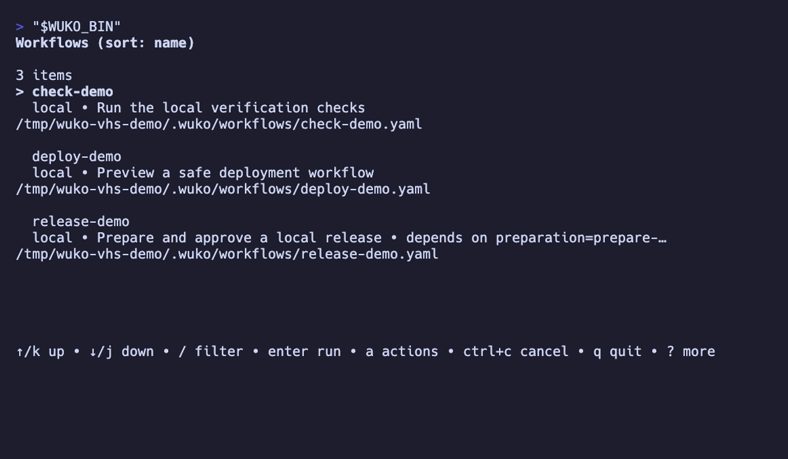
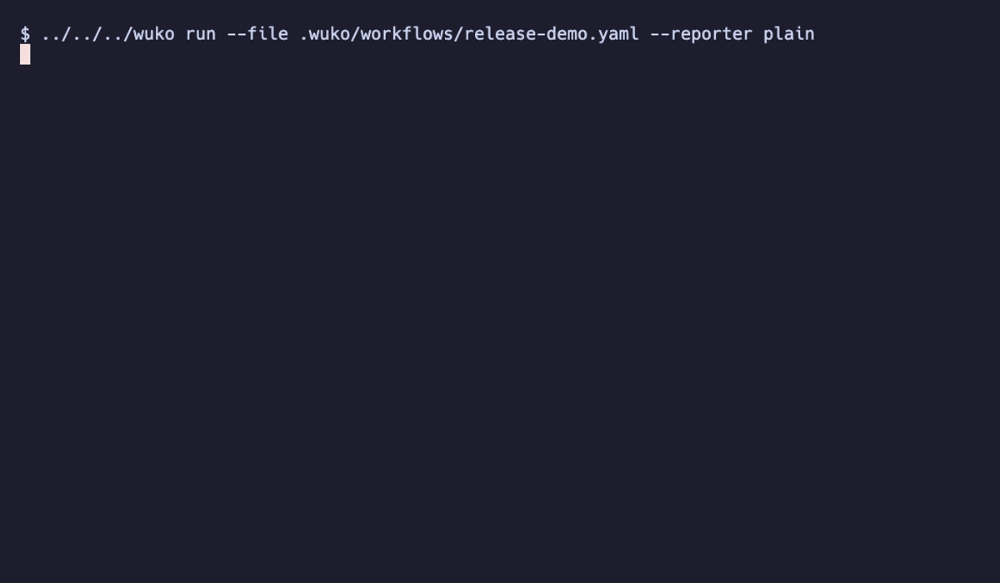

# Wuko

Wuko is a trusted, local workflow runner for development tasks. Workflows are strict, versioned
YAML files made from independently registered Go step packages. They can prompt for input, work
with typed data and files, call APIs, run scripts or containers, and start coding agents.

## Features

- **Local-first workflows** — keep readable automation beside the code it changes.
- **Interactive runs** — collect text, passwords, choices, filesystem paths, and confirmations in
  the terminal.
- **Local browser forms** — collect typed variables, load dynamic choices, follow live progress,
  and render explicit workflow results without changing standard runs.
- **Typed workflow state** — use variables, step outputs, JSON/TOML imports, JSONPath, semantic
  versions, templates, and expressions without converting everything to strings.
- **Useful execution controls** — conditions, early successful returns, retries, timeouts, polling,
  concurrency, batch, foreach and matrix expansion, scoped working-directory blocks, scheduled runs, dry
  runs, execution trees, and guaranteed cleanup.
- **Portable operations** — use built-in HTTP, filesystem, glob, native watches, cache, change detection,
  key-value, temporary resource, and Docker steps instead of platform-specific shell commands.
- **Extensible automation** — run Lua, direct commands, inline shell, or an external agent such as
  Codex.
- **Reusable definitions** — split steps across files, compose local actions, and consume public
  remote workflows or pinned remote actions.
- **Visible execution** — get live progress, retry and polling details, run statistics, and
  redacted debug tracing.

## See Wuko in action

The workflow picker and an end-to-end interactive run are recorded from deterministic, offline
fixtures:





See [Screenshot and demo maintenance](docs/screenshots.md) for the VHS tapes, fixtures, and local
regeneration commands.

Wuko is not a GitHub Actions runtime. It is designed for local and interactive development
automation; GitHub Actions is designed for repository-hosted CI/CD. A CI job may invoke Wuko, but
the two workflow formats are separate.

## Install

On macOS:

```sh
brew install --cask up2jj/tap/wuko
```

With Go 1.26 or newer:

```sh
go install github.com/up2jj/wuko@latest
```

For repository development:

```sh
just build
just test
```

Run `just hooks` once to install the prek hooks. Use `prek run --all-files` to run every hook and
`just snapshot` to build local release archives.

## Quick start

Create `.wuko/workflows/check.yaml`:

```yaml
version: 1
name: check
description: Run the project checks

vars:
  package: ./...

steps:
  - id: tests
    type: shell
    with:
      command: go
      args: [test, "{{ .vars.package }}"]

  - id: summary
    type: shell
    with:
      command: printf
      args: ["tests exited with %s\n", "{{ .steps.tests.exit_code }}"]
```

Then discover, inspect, validate, or run it:

```sh
wuko
wuko list
wuko tree check
wuko validate check
wuko run check
wuko ui check
wuko run check --var package=./cmd/...
wuko run check --dry-run
wuko install https://example.com/workflows/release.yaml
wuko install https://example.com/workflows
wuko install --global https://example.com/workflows
wuko install --global github:acme/workflows@main:release.yaml
wuko uninstall release
wuko uninstall --global --yes release
```

Bare `wuko` opens a searchable picker in a terminal and shows each workflow's direct prerequisites.
Press Enter to run the selected workflow, `u` to open a declared browser form, `e` to open it in
the configured editor, `p` to toggle its plain-text `[pinned]` marker, or `s` to switch between
name and recently-used sorting. Shift+Enter prints its reproducible `wuko run` command. Picker
pins, successful-run history, and the sort preference are stored globally, and unavailable
workflows are pruned.
`wuko run NAME` searches the nearest
`.wuko/workflows/` directory first, then the user workflow directories. Use `--file` for an explicit
path:

```sh
wuko run --file ./workflows/release.yaml
```

See [Workflow discovery](docs/workflow-discovery.md) for search order, shadowing, and
non-interactive behavior.

`wuko install SOURCE` saves a standalone workflow under the current project’s `.wuko/workflows/`
directory. Use `--global` to save it under `~/.wuko/workflows/` instead. `SOURCE` may be a local
YAML file, an HTTPS URL, or a `github:` locator. An HTTPS repository URL is also checked for a
versioned `manifest.json`; when found, Wuko opens the same searchable picker as bare `wuko` and
allows one or more workflows to be installed. Marketplace workflows are stored under a
repository-named subdirectory to avoid conflicts. Use `wuko marketplace init` to create an empty
manifest and `wuko marketplace build` to discover `.wuko/workflows/` recursively and rebuild it.
Install and uninstall also accept the `--var`, `--var-file`, and `--env` flags for lifecycle hooks.

Workflows may declare optional installation lifecycle steps:

```yaml
install:
  - id: setup
    type: shell
    with: {script: echo setup}

uninstall:
  - id: cleanup
    type: shell
    with: {script: echo cleanup}
```

Install hooks run before the staged workflow is committed. Uninstall hooks run after confirmation
and before the workflow is removed. `wuko uninstall` asks for confirmation; use `--yes` for
non-interactive use. Installed sources must be standalone manifests; local required step files,
file-backed templates, local actions, and relative lifecycle scripts are rejected. Without
`--global`, uninstall targets the current project’s workflow copy.

## GitHub Actions

Wuko can report a run through GitHub Actions without changing the workflow format. Reporters are
explicit and repeatable: `plain` keeps the normal progress log, while `github` adds error
annotations, a job summary, and step outputs. GitHub supplies the output and summary files to every
run step.

```yaml
- name: Run Wuko checks
  id: wuko
  run: wuko run check --once --reporter plain --reporter github
  env:
    API_TOKEN: ${{ secrets.API_TOKEN }}

- uses: actions/upload-artifact@v4
  with:
    path: ${{ steps.wuko.outputs.artifact }}
```

`--once` runs a workflow immediately even when it declares `cron`, leaving GitHub responsible for
the schedule. Values produced by a successful workflow `return` are exported by name. Wuko also
exports the complete typed output map as JSON under `wuko_outputs`. The GitHub reporter is never
enabled automatically; omit all `--reporter` flags to use only the default plain reporter.

## Workflow building blocks

Every workflow has a schema version, name, and ordered steps. It may also define a description,
variables, environment values, templates, a cron schedule, and cleanup steps:

```yaml
version: 1
name: release
description: Build and publish a release
cron: "0 9 * * 1-5"
timezone: Europe/Warsaw

vars:
  target: linux

env:
  API_TOKEN: "{{ .env.API_TOKEN }}"

steps:
  - id: build
    type: shell
    timeout: 5m
    retry:
      max_attempts: 3
    with:
      command: ./build
      args: ["{{ .vars.target }}"]
    defer:
      - id: remove_build
        type: shell
        with: {command: ./remove-build}

  - id: publish
    type: shell
    if: steps.build.exit_code == 0
    with:
      command: ./publish
      args: ["{{ .steps.build.stdout }}"]

finally:
  - id: cleanup
    type: shell
    with:
      command: ./cleanup
```

Steps run in declaration order. A successful step publishes outputs under `.steps.<id>` for Go
templates and `steps.<id>` for expressions. Variables live under `.vars`/`vars`. A failed step
stops ordinary execution. Cleanup attached with `defer` is registered after its owner succeeds,
then runs in reverse owner order before `finally`.

A workflow can require other discovered workflows and consume their declared typed outputs:

```yaml
version: 1
name: release
depends_on:
  build: build-artifacts
steps:
  - id: publish
    type: shell
    with:
      command: ./publish.sh
      args: ["{{ .dependencies.build.artifact }}"]
```

Prerequisites form sequential chains, shared prerequisites run once per invocation, and failures
stop dependent workflows. See [Workflow prerequisites](docs/execution.md#workflow-prerequisites)
for output contracts, validation rules, scheduling behavior, and runnable examples.

See the [Documentation](#documentation) section for detailed workflow syntax and execution
guides.

## Available steps

Each linked guide contains multiple examples for every step.

| Step | Use it to | Examples |
| --- | --- | --- |
| `tui_input` | Collect editable text or typed JSON/lists | [Interactive steps](docs/steps-interactive.md#tui_input) |
| `tui_password` | Collect masked text | [Interactive steps](docs/steps-interactive.md#tui_password) |
| `tui_choice` | Select bounded static/dynamic values with defaults | [Interactive steps](docs/steps-interactive.md#tui_choice) |
| `tui_path` | Select one or many files/directories | [Interactive steps](docs/steps-interactive.md#tui_path) |
| `tui_review` | Review plain text or a colored unified diff | [Interactive steps](docs/steps-interactive.md#tui_review) |
| `tui_confirm` | Collect a boolean decision | [Interactive steps](docs/steps-interactive.md#tui_confirm) |
| `set` | Assign a literal or expression result | [Data steps](docs/steps-data.md#set) |
| `assert` | Stop unless an expression is true | [Data steps](docs/steps-data.md#assert) |
| `import_vars` | Load JSON or TOML into workflow state | [Data steps](docs/steps-data.md#import_vars) |
| `jsonpath` | Select values with RFC 9535 JSONPath | [Data steps](docs/steps-data.md#jsonpath) |
| `extract` | Extract typed fields from text | [Text extraction](docs/extract.md) |
| `semver` | Parse, compare, constrain, or increment versions | [Data steps](docs/steps-data.md#semver) |
| `key_value` | Persist JSON-compatible values between runs | [Data steps](docs/steps-data.md#key_value) |
| `changed` | Detect changed files or structured inputs | [Data steps](docs/steps-data.md#changed) |
| `require_tool` | Require an executable and optionally validate its version | [System steps](docs/steps-system.md#require_tool) |
| `git_clean` | Assert that a Git working tree is clean | [System steps](docs/steps-system.md#git_clean) |
| `git_branch` | Assert local branch existence with an extensible operation schema | [System steps](docs/steps-system.md#git_branch) |
| `git_remote_branch` | Assert local remote-tracking branch existence | [System steps](docs/steps-system.md#git_remote_branch) |
| `git_branch_name` | Assert that a string is a valid Git branch name | [System steps](docs/steps-system.md#git_branch_name) |
| `git_on_branch` | Assert the repository's current branch | [System steps](docs/steps-system.md#git_on_branch) |
| `github_pr` | Find an open GitHub pull request from CI metadata or a Git branch | [System steps](docs/steps-system.md#github_pr) |
| `github_actions` | Observe one GitHub Actions run through `gh` | [System steps](docs/steps-system.md#github_actions) |
| `file` | Perform shell-independent filesystem operations | [System steps](docs/steps-system.md#file) |
| `glob` | Discover regular files with portable patterns | [System steps](docs/steps-system.md#glob) |
| `watch` | Wait for native filesystem events | [System steps](docs/steps-system.md#watch) |
| `log_wait` | Follow a growing log until a regex matches | [System steps](docs/steps-system.md#log_wait) |
| `temp` | Create automatically cleaned files, directories, or FIFOs | [System steps](docs/steps-system.md#temp) |
| `cache` | Restore and save directory caches | [System steps](docs/steps-system.md#cache) |
| `http` | Make structured HTTP API calls | [System steps](docs/steps-system.md#http) |
| `docker` | Run containers and manage Docker files and resources | [System steps](docs/steps-system.md#docker) |
| `shell` | Run argv commands or inline shell | [Automation steps](docs/steps-automation.md#shell) |
| `agent` | Start an external coding agent with a prompt | [Automation steps](docs/steps-automation.md#agent) |
| `lua` | Run typed in-process automation | [Automation steps](docs/steps-automation.md#lua) |
| `wait` | Delay or poll another step | [Automation steps](docs/steps-automation.md#wait) |

## Workflow controls

Use controls to run independent work or repeat a block over runtime data.

| Control | Use it to | Examples |
| --- | --- | --- |
| `if` | Run a step or sequential block only when an expression is true | [Execution and composition](docs/execution.md#conditions) |
| `working_directory` | Run a block from an existing directory | [Execution and composition](docs/execution.md#scoped-working-directories) |
| `concurrent` | Run a fixed set of independent steps in parallel | [Execution and composition](docs/execution.md#concurrency) |
| `batch` | Process a runtime list in fixed-size chunks | [Workflow controls](docs/workflow-control.md#batch) |
| `foreach` | Run a block once per item in a runtime list | [Workflow controls](docs/workflow-control.md#foreach) |
| `matrix` | Run every combination of named dimensions | [Workflow controls](docs/workflow-control.md#matrix) |
| `loop` | Repeat a sequential block until an expression is true | [Workflow controls](docs/workflow-control.md#loop) |
| `timeout` | Bound how long a step or control may run | [Execution and composition](docs/execution.md#timeouts-and-retries) |
| `retry` | Retry failed operations with backoff | [Execution and composition](docs/execution.md#timeouts-and-retries) |
| `return` | Finish successfully early and publish explicit outputs | [Early successful return](docs/return.md) |
| `defer` | Attach cleanup to a successful step | [Finally cleanup](docs/finally.md) |
| `finally` | Run workflow-level cleanup after the main phase | [Finally cleanup](docs/finally.md) |
| `install` | Run steps before an installed workflow is committed | [Workflow installation](docs/execution.md#workflow-installation) |
| `uninstall` | Run steps before an installed workflow is removed | [Workflow installation](docs/execution.md#workflow-installation) |
| `marketplace init/build` | Create or rebuild a versioned workflow marketplace manifest | [Workflow installation](docs/execution.md#workflow-marketplaces) |
| `cron` | Run a workflow on a schedule | [Execution and composition](docs/execution.md#scheduled-runs) |

## Workflow composition

| Pattern | Use it to | Examples |
| --- | --- | --- |
| `depends_on` | Run another discovered workflow first and consume its declared outputs | [Workflow prerequisites](docs/execution.md#workflow-prerequisites) |
| `targets` | Divide one workflow into named executable variants selected as `wuko run NAME TARGET` | [Workflow targets](docs/execution.md#workflow-targets) |
| `invokable: false` | Keep a workflow available as a prerequisite without allowing direct invocation | [Workflow prerequisites](docs/execution.md#workflow-prerequisites) |
| `require` | Split one workflow across files while keeping the same state and step sequence | [Splitting a workflow across files](docs/execution.md#splitting-a-workflow-across-files) |
| `uses` | Reuse a composite action with explicit inputs, isolated internals, and declared outputs | [Composite actions](docs/execution.md#composite-actions) |

See [Choosing a composition mechanism](docs/execution.md#choosing-a-composition-mechanism) for a
side-by-side comparison and examples.

## Agent skills

Wuko can install its bundled skills for supported coding-agent CLIs found on `PATH`:

```sh
wuko agent list
wuko agent install claude
wuko agent install
```

Claude skills are installed under `~/.claude/skills/`; Codex skills are installed under
`~/.agents/skills/`. Reinstalling replaces the bundled skill files.

## Documentation

- [Execution and composition](docs/execution.md)
- [ClickUp task agent example](docs/clickup-task-example.md)
- [Interactive steps](docs/steps-interactive.md)
- [Data steps](docs/steps-data.md)
- [System steps](docs/steps-system.md)
- [Automation steps](docs/steps-automation.md)
- [Filesystem operation reference](docs/filesystem-operations.md)
- [Docker operation reference](docs/docker-operations.md)
- [Workflow controls](docs/workflow-control.md)
- [Early successful return](docs/return.md)
- [Workflow discovery](docs/workflow-discovery.md)
- [Templates](docs/templates.md)
- [Template, Expr, and Lua functions](docs/template-functions.md)
- [Variable imports](docs/variable-imports.md)
- [Finally cleanup](docs/finally.md)
- [Graceful shutdown](docs/graceful-shutdown.md)
- [Screenshot and demo maintenance](docs/screenshots.md)

## Trust model

Workflows and composite actions are trusted code. Lua, shell, agent, Docker, and command-based action
sources can access local resources with the permissions granted to Wuko. Review publishers, pin
immutable remote action releases with SHA-256, and do not mount the Docker socket for untrusted
workflows. Safe archive extraction is not an execution sandbox, and Wuko does not provide a
secrets store.
